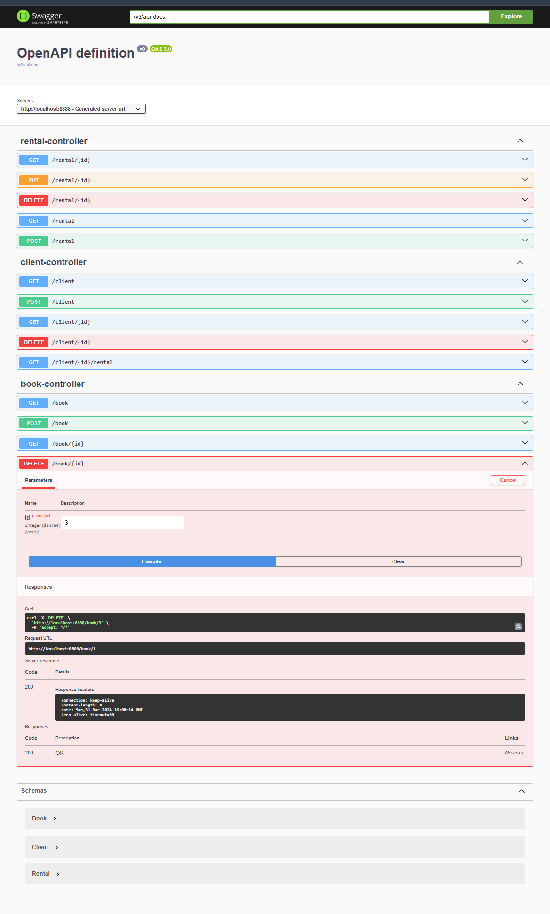

Так и не понял точно как использовать DTO объекты . Они не участвуют 

Thymeleaf 
[clientsRental.html](src%2Fmain%2Fresources%2Ftemplates%2FclientsRental.html)
[rentals.html](src%2Fmain%2Fresources%2Ftemplates%2Frentals.html)
[clients.html](src%2Fmain%2Fresources%2Ftemplates%2Fclients.html)
[books.html](src%2Fmain%2Fresources%2Ftemplates%2Fbooks.html)


База данных запускается с [compose.yaml](compose.yaml). 
В [application.yml](src%2Fmain%2Fresources%2Fapplication.yml) настроено подключение


Ниже домашка по API



```json

{
  "openapi": "3.0.1",
  "info": {
    "title": "OpenAPI definition",
    "version": "v0"
  },
  "servers": [
    {
      "url": "http://localhost:8888",
      "description": "Generated server url"
    }
  ],
  "paths": {
    "/rental/{id}": {
      "get": {
        "tags": [
          "rental-controller"
        ],
        "operationId": "getRentalById",
        "parameters": [
          {
            "name": "id",
            "in": "path",
            "required": true,
            "schema": {
              "type": "integer",
              "format": "int64"
            }
          }
        ],
        "responses": {
          "200": {
            "description": "OK",
            "content": {
              "*/*": {
                "schema": {
                  "$ref": "#/components/schemas/Rental"
                }
              }
            }
          }
        }
      },
      "put": {
        "tags": [
          "rental-controller"
        ],
        "operationId": "returnRentalById",
        "parameters": [
          {
            "name": "id",
            "in": "path",
            "required": true,
            "schema": {
              "type": "integer",
              "format": "int64"
            }
          }
        ],
        "responses": {
          "200": {
            "description": "OK",
            "content": {
              "*/*": {
                "schema": {
                  "$ref": "#/components/schemas/Rental"
                }
              }
            }
          }
        }
      },
      "delete": {
        "tags": [
          "rental-controller"
        ],
        "operationId": "deleteById",
        "parameters": [
          {
            "name": "id",
            "in": "path",
            "required": true,
            "schema": {
              "type": "integer",
              "format": "int64"
            }
          }
        ],
        "responses": {
          "200": {
            "description": "OK"
          }
        }
      }
    },
    "/rental": {
      "get": {
        "tags": [
          "rental-controller"
        ],
        "operationId": "getRentals",
        "responses": {
          "200": {
            "description": "OK",
            "content": {
              "*/*": {
                "schema": {
                  "type": "array",
                  "items": {
                    "$ref": "#/components/schemas/Rental"
                  }
                }
              }
            }
          }
        }
      },
      "post": {
        "tags": [
          "rental-controller"
        ],
        "operationId": "createRental",
        "requestBody": {
          "content": {
            "application/json": {
              "schema": {
                "$ref": "#/components/schemas/Rental"
              }
            }
          },
          "required": true
        },
        "responses": {
          "200": {
            "description": "OK",
            "content": {
              "*/*": {
                "schema": {
                  "$ref": "#/components/schemas/Rental"
                }
              }
            }
          }
        }
      }
    },
    "/client": {
      "get": {
        "tags": [
          "client-controller"
        ],
        "operationId": "getClients",
        "responses": {
          "200": {
            "description": "OK",
            "content": {
              "*/*": {
                "schema": {
                  "type": "array",
                  "items": {
                    "$ref": "#/components/schemas/Client"
                  }
                }
              }
            }
          }
        }
      },
      "post": {
        "tags": [
          "client-controller"
        ],
        "operationId": "createClient",
        "requestBody": {
          "content": {
            "application/json": {
              "schema": {
                "$ref": "#/components/schemas/Client"
              }
            }
          },
          "required": true
        },
        "responses": {
          "200": {
            "description": "OK",
            "content": {
              "*/*": {
                "schema": {
                  "$ref": "#/components/schemas/Client"
                }
              }
            }
          }
        }
      }
    },
    "/book": {
      "get": {
        "tags": [
          "book-controller"
        ],
        "operationId": "getBooks",
        "responses": {
          "200": {
            "description": "OK",
            "content": {
              "*/*": {
                "schema": {
                  "type": "array",
                  "items": {
                    "$ref": "#/components/schemas/Book"
                  }
                }
              }
            }
          }
        }
      },
      "post": {
        "tags": [
          "book-controller"
        ],
        "operationId": "createBook",
        "requestBody": {
          "content": {
            "application/json": {
              "schema": {
                "$ref": "#/components/schemas/Book"
              }
            }
          },
          "required": true
        },
        "responses": {
          "200": {
            "description": "OK",
            "content": {
              "*/*": {
                "schema": {
                  "$ref": "#/components/schemas/Book"
                }
              }
            }
          }
        }
      }
    },
    "/client/{id}": {
      "get": {
        "tags": [
          "client-controller"
        ],
        "operationId": "getClientById",
        "parameters": [
          {
            "name": "id",
            "in": "path",
            "required": true,
            "schema": {
              "type": "integer",
              "format": "int64"
            }
          }
        ],
        "responses": {
          "200": {
            "description": "OK",
            "content": {
              "*/*": {
                "schema": {
                  "$ref": "#/components/schemas/Client"
                }
              }
            }
          }
        }
      },
      "delete": {
        "tags": [
          "client-controller"
        ],
        "operationId": "deleteById_1",
        "parameters": [
          {
            "name": "id",
            "in": "path",
            "required": true,
            "schema": {
              "type": "integer",
              "format": "int64"
            }
          }
        ],
        "responses": {
          "200": {
            "description": "OK"
          }
        }
      }
    },
    "/client/{id}/rental": {
      "get": {
        "tags": [
          "client-controller"
        ],
        "operationId": "getClientsRentals",
        "parameters": [
          {
            "name": "id",
            "in": "path",
            "required": true,
            "schema": {
              "type": "integer",
              "format": "int64"
            }
          }
        ],
        "responses": {
          "200": {
            "description": "OK",
            "content": {
              "*/*": {
                "schema": {
                  "type": "array",
                  "items": {
                    "$ref": "#/components/schemas/Rental"
                  }
                }
              }
            }
          }
        }
      }
    },
    "/book/{id}": {
      "get": {
        "tags": [
          "book-controller"
        ],
        "operationId": "getBookById",
        "parameters": [
          {
            "name": "id",
            "in": "path",
            "required": true,
            "schema": {
              "type": "integer",
              "format": "int64"
            }
          }
        ],
        "responses": {
          "200": {
            "description": "OK",
            "content": {
              "*/*": {
                "schema": {
                  "$ref": "#/components/schemas/Book"
                }
              }
            }
          }
        }
      },
      "delete": {
        "tags": [
          "book-controller"
        ],
        "operationId": "deleteById_2",
        "parameters": [
          {
            "name": "id",
            "in": "path",
            "required": true,
            "schema": {
              "type": "integer",
              "format": "int64"
            }
          }
        ],
        "responses": {
          "200": {
            "description": "OK"
          }
        }
      }
    }
  },
  "components": {
    "schemas": {
      "Book": {
        "type": "object",
        "properties": {
          "id": {
            "type": "integer",
            "format": "int64"
          },
          "name": {
            "type": "string"
          },
          "author": {
            "type": "string"
          }
        }
      },
      "Client": {
        "type": "object",
        "properties": {
          "id": {
            "type": "integer",
            "format": "int64"
          },
          "name": {
            "type": "string"
          },
          "contact": {
            "type": "string"
          }
        }
      },
      "Rental": {
        "type": "object",
        "properties": {
          "id": {
            "type": "integer",
            "format": "int64"
          },
          "client": {
            "$ref": "#/components/schemas/Client"
          },
          "book": {
            "$ref": "#/components/schemas/Book"
          },
          "startTime": {
            "type": "string",
            "format": "date-time"
          },
          "returnTime": {
            "type": "string",
            "format": "date-time"
          }
        }
      }
    }
  }
}
```